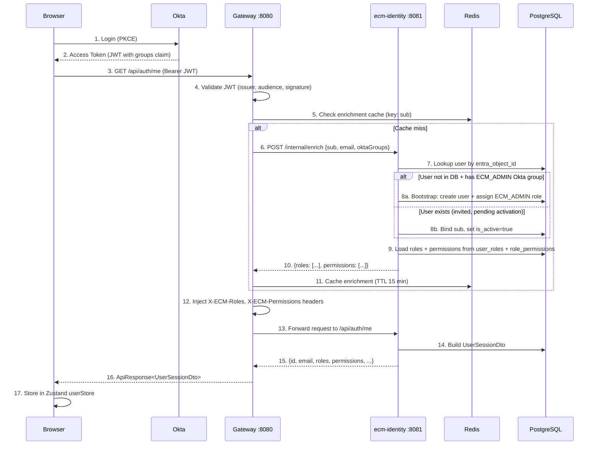
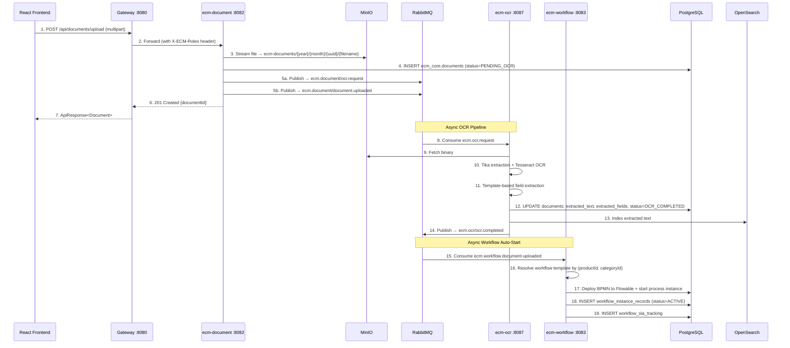
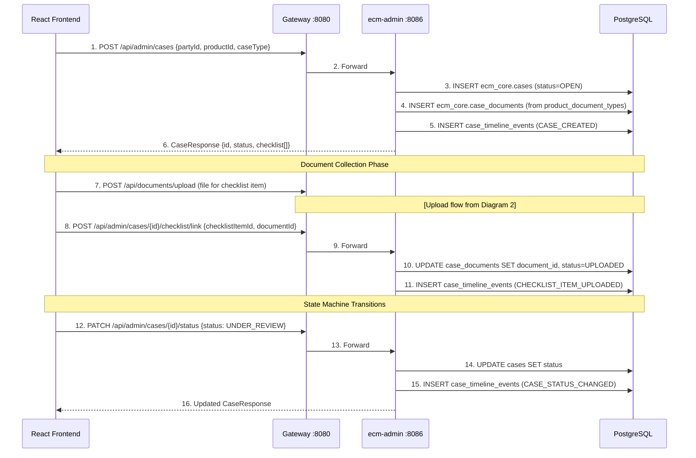
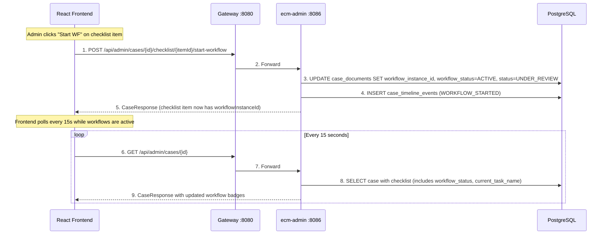
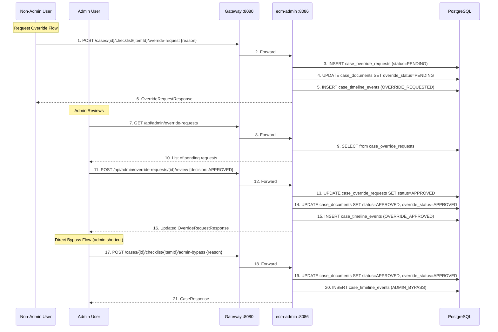
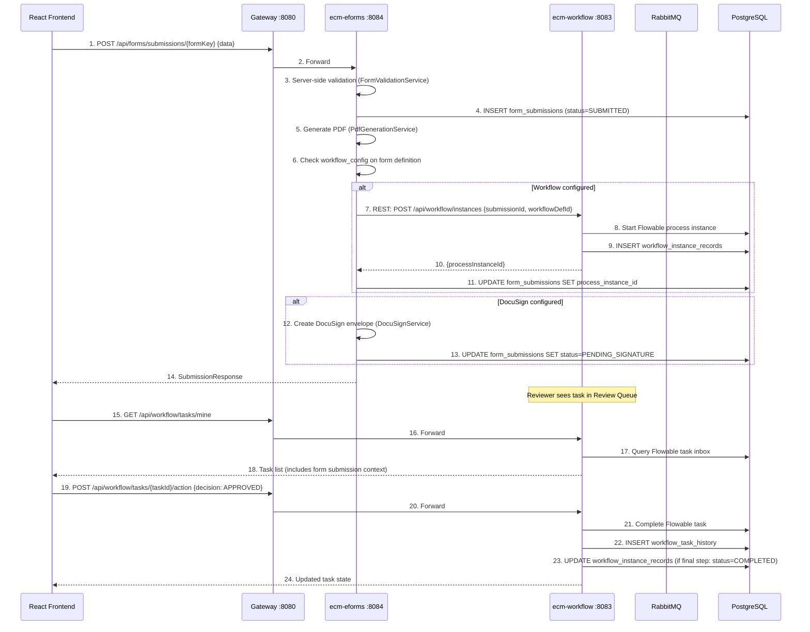
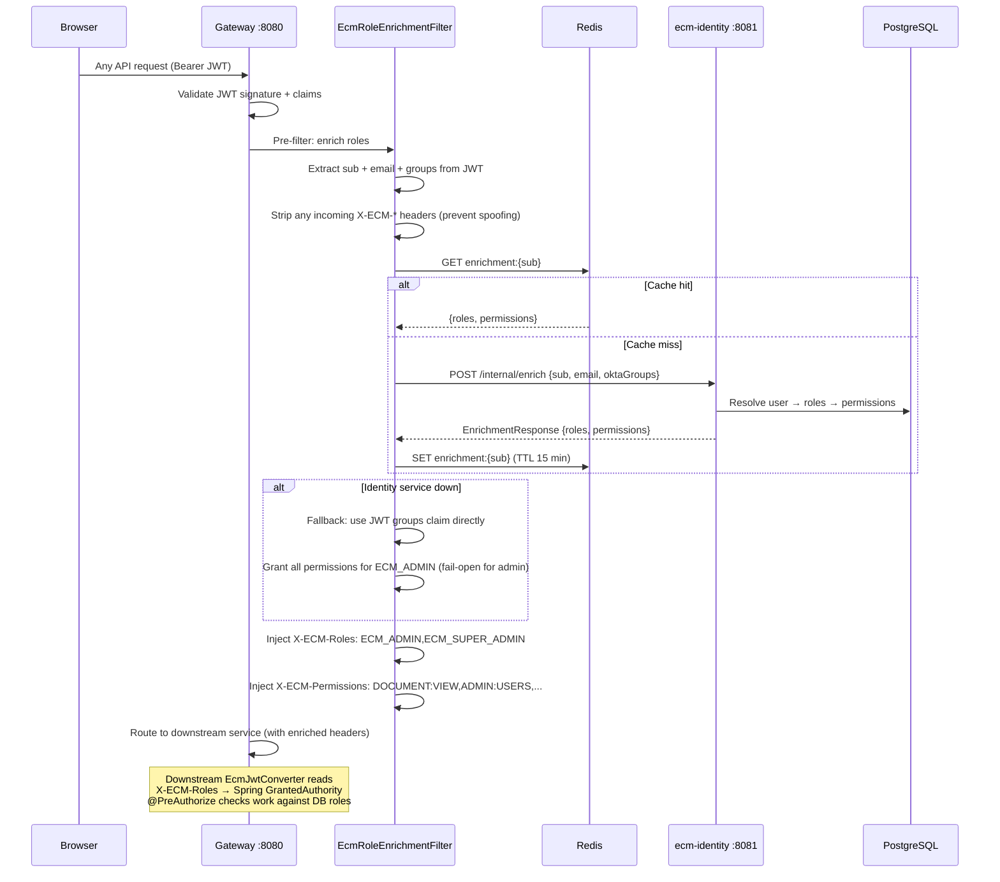
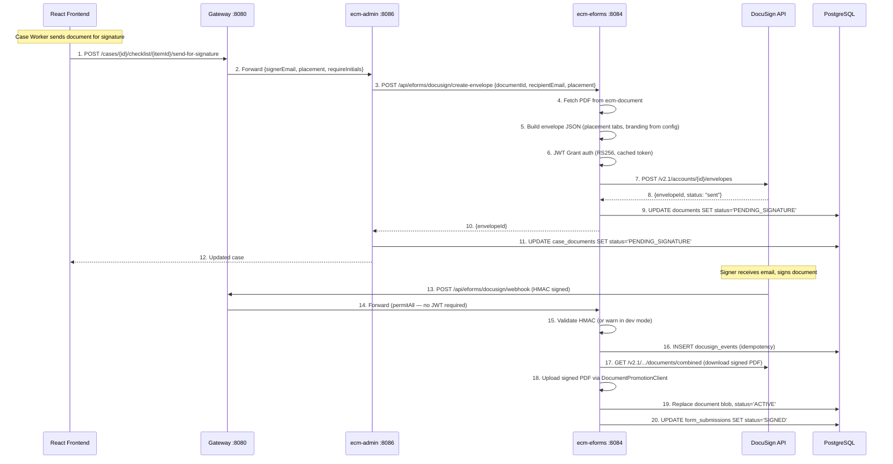

# Servus ECM Platform — Backend

> **Enterprise Content Management for Financial Institutions**
> White-label · Multi-tenant · Microservices · Java 21 · Spring Boot 3.3.5

[](https://openjdk.org/)
[](https://spring.io/projects/spring-boot)
[](https://www.postgresql.org/)
[](https://www.rabbitmq.com/)
[](https://min.io/)

---

## Table of Contents

- [Overview](#overview)
- [Architecture](#architecture)
- [Sequence Diagrams](#sequence-diagrams)
- [Technology Stack](#technology-stack)
- [Module Structure](#module-structure)
- [Infrastructure Services](#infrastructure-services)
- [Database Schema](#database-schema)
- [Security & Authentication](#security--authentication)
- [Message Flows (RabbitMQ)](#message-flows-rabbitmq)
- [Case-Workflow Integration](#case-workflow-integration)
- [API Reference](#api-reference)
- [Local Development Setup](#local-development-setup)
- [Seed Data Scripts](#seed-data-scripts)
- [Environment Variables](#environment-variables)
- [Flyway Migrations](#flyway-migrations)
- [Known Issues & Bugs](#known-issues--bugs)
- [Production Deployment](#production-deployment)

---

## Overview

Servus ECM is a white-label Enterprise Content Management platform targeting financial institutions — credit unions, banks, and insurance providers. It manages the full document lifecycle: ingestion, OCR, workflow-based review, electronic forms, digital signing, archiving, and retention enforcement.

### Key Capabilities

| Capability | Module | Status |
|---|---|---|
| SSO login via Okta / Microsoft Entra ID | ecm-identity | Done |
| Document upload, versioning, storage | ecm-document | Done |
| API Gateway — routing, rate limiting, circuit breakers | ecm-gateway | Done |
| BPMN workflow automation (Flowable) | ecm-workflow | Done |
| Low-code eForm designer + renderer | ecm-eforms | Done |
| Platform administration & tenant config | ecm-admin | Done |
| Async OCR (Tika + Tesseract) | ecm-ocr | Done |
| Email / in-app notifications | ecm-notification | Done |
| Case management + state machine | ecm-admin | Done |
| Case-workflow integration (checklist bridge) | ecm-admin + ecm-workflow | Done |
| Override / bypass system with audit trail | ecm-admin | Done |
| SUPER_ADMIN role separation | ecm-identity + all | Done |
| DocuSign eSignature (SDK-free REST API) | ecm-eforms | Done |
| Document locking (checkout/checkin) | ecm-document | Done |
| Case-based implicit document locking | ecm-document + ecm-admin | Done |
| Document retention & archiving scheduler | ecm-document | Done |
| Azure Document Intelligence OCR | ecm-ocr | Done |
| SLA tracking & breach detection | ecm-workflow | Done |
| Document pipeline visualization | Frontend | Done |
| CSP security headers | ecm-common | Done |

---

## Architecture

```
                    +-------------------------------------------------+
                    |          React Frontend  :3000                   |
                    |   Vite · React 18 · TanStack Query · Zustand    |
                    +-----------------------+-------------------------+
                                            | HTTPS / Bearer JWT
                    +-----------------------v-------------------------+
                    |            ECM Gateway  :8080                    |
                    |  JWT validation · Role enrichment · CORS         |
                    |  Rate limit · Circuit breaker · Correlation ID   |
                    |                                                  |
                    |  EcmRoleEnrichmentFilter:                        |
                    |    JWT sub → ecm-identity /internal/enrich       |
                    |    → injects X-ECM-Roles, X-ECM-Permissions      |
                    |    → cached in Redis (15 min TTL)                |
                    +--+-------+-------+-------+-------+-------+------+
                       |       |       |       |       |       |
                     :8081   :8082   :8083   :8084   :8086   :8088
                   Identity Document Workflow eForms  Admin  Notification
                       |       |       |       |       |
                       v       v       v       v       v
                    PostgreSQL  MinIO  Flowable DocuSign
                    (5 schemas) (4 bkt) (embed)  (webhook)
                       |       |
                       +---+---+
                           | RabbitMQ :5672
                           |   ecm.document exchange
                           |     +-- ocr.request -----> ecm-ocr :8087
                           |     +-- document.uploaded -> ecm-workflow
                           |   ecm.ocr exchange
                           |     +-- ocr.completed ----> ecm-document
                           |
                        Redis :6379          OpenSearch :9200
                     (enrichment cache       (full-text search)
                      + rate limit)
```

### Design Principles

- **Single entry point**: All frontend traffic enters through the gateway. Downstream services are never directly exposed.
- **Role enrichment at gateway**: Gateway calls ecm-identity to resolve DB roles + permissions, injects as `X-ECM-Roles`/`X-ECM-Permissions` headers. Downstream `EcmJwtConverter` reads these — NOT the raw JWT groups claim.
- **Schema isolation**: Each module owns its own PostgreSQL schema. Cross-schema writes use `JdbcTemplate`, not JPA, to avoid accidental migration coupling.
- **Soft deletes only**: No `DELETE` statements. All deactivation sets `is_active = false`.
- **Graceful degradation**: RabbitMQ and workflow triggers degrade non-fatally. A failed event publish logs a warning but does not fail the HTTP request. If identity enrichment times out, gateway falls back to JWT groups claim directly.

---

## Sequence Diagrams

### 1. User Login & Session



### 2. Document Upload → OCR → Workflow



### 3. Case Lifecycle (State Machine)



### 4. Checklist → Workflow Bridge



### 5. Override / Bypass System



### 6. eForm Submission → Workflow → Review



### 7. Gateway Role Enrichment (Detail)



### 8. DocuSign Signing Flow



---

## Technology Stack

| Technology | Version | Role |
|---|---|---|
| **Java** | 21 (LTS) | Runtime. Virtual threads (Project Loom) for high-concurrency I/O. |
| **Spring Boot** | 3.3.5 | Application framework across all 9 modules. |
| **Spring Cloud Gateway** | 2023.0.3 | API gateway — routing, rate limiting, circuit breakers, CORS. |
| **Spring Security OAuth2** | Boot-managed | JWT resource server. Validates Okta/Entra tokens. |
| **Flowable BPM** | 7.0.0 | Embedded BPMN 2.0 engine for workflow automation. |
| **PostgreSQL** | 16 (Alpine) | Primary relational store. 5 logical schemas. |
| **Flyway** | 10.10.0 | Database migrations. Per-module `V*.sql` files. |
| **MinIO** | Latest | S3-compatible object storage for documents. Swappable with Azure Blob. |
| **RabbitMQ** | 3.x | Async event bus. Decouples upload → OCR → workflow pipeline. |
| **Redis** | 7 (Alpine) | Enrichment cache (gateway) + rate-limit counters. |
| **OpenSearch** | 1.5.2 | Full-text search index on extracted document text. |
| **Apache Tika** | 3.0.0 | Document content extraction and OCR orchestration. |
| **Tesseract** | via Tika | OCR engine for scanned PDFs and images. |
| **Resilience4j** | Cloud-managed | Circuit breakers, time limiters, retries on gateway routes. |
| **Lombok** | 1.18.34 | Code generation (`@Builder`, `@Slf4j`, etc.). |
| **MapStruct** | 1.5.5 | Compile-time DTO mapping in ecm-document. |
| **Maven** | 3.9+ | Multi-module build. All dependency versions pinned in root `pom.xml`. |

---

## Module Structure

```
ecm-platform/
├── pom.xml                    ← Root POM — all dependency versions defined here
├── docker-compose.yml         ← Full infrastructure stack
├── infrastructure/
│   └── sql/
│       ├── init.sql                    ← Master DB bootstrap (run once on fresh install)
│       ├── seed-workflow-templates.sql ← 3 BPMN workflow templates (run on demand)
│       ├── seed-test-data.sql          ← Test customers, enrollments, checklists (run on demand)
│       └── seed-test-cases.sql         ← Test cases with auto-populated checklists (run on demand)
├── startServices.sh           ← Helper to start all services
│
├── ecm-common/                ← Shared library (JAR, not deployable)
├── ecm-identity/              ← Port 8081 — Auth, user provisioning, role enrichment
├── ecm-document/              ← Port 8082 — Document lifecycle
├── ecm-gateway/               ← Port 8080 — API Gateway (entry point)
├── ecm-workflow/              ← Port 8083 — BPMN workflow engine
├── ecm-eforms/                ← Port 8084 — Low-code eForms
├── ecm-admin/                 ← Port 8086 — Platform admin, cases, overrides
├── ecm-ocr/                   ← Port 8087 — Async OCR worker
└── ecm-notification/          ← Port 8088 — Email templates, in-app notifications
```

---

### `ecm-common` — Shared Library

Not a deployable service. Included as a Maven dependency by all other modules.

| Component | Class | Purpose |
|---|---|---|
| Security config | `SecurityConfig` | Base JWT resource server config. Registers `EcmJwtConverter`. CORS disabled (owned by gateway). |
| JWT converter | `EcmJwtConverter` | Reads `X-ECM-Roles`/`X-ECM-Permissions` headers (production) or JWT groups claim (local dev fallback). Maps to Spring `GrantedAuthority`. |
| Permission evaluator | `EcmPermissionEvaluator` | Enables `hasPermission()` expressions in `@PreAuthorize`. |
| Audience validator | `AudienceValidator` | Validates JWT `aud` claim. |
| Audit annotation | `@AuditLog` | Method-level annotation. Triggers `AuditAspect` AOP interceptor. |
| Audit aspect | `AuditAspect` | Captures identity + IP before method runs. Writes to DB asynchronously via `AuditWriter`. |
| Audit writer | `AuditWriter` | `@Async` bean. Writes to `ecm_audit.audit_log`. Non-blocking. |
| Response wrapper | `ApiResponse<T>` | Standard envelope: `{ success, data, message }`. All endpoints return this. |
| Exception handler | `GlobalExceptionHandler` | Converts exceptions to structured `ApiResponse` error responses. |

> **Audit annotation order**: `@AuditLog` must be the **outer** annotation, `@Transactional` the **inner**. This ensures a DB rollback produces a `FAILURE` audit record, not a false `SUCCESS`.

---

### `ecm-gateway` — Port 8080

Single entry point. All external traffic passes through here.

**Key components:**

| Component | Purpose |
|---|---|
| `GatewaySecurityConfig` | JWT validation + CORS (sole owner) |
| `EcmRoleEnrichmentFilter` | Calls ecm-identity to resolve DB roles → injects X-ECM-Roles/Permissions headers |
| `RouteConfig` | All route definitions to downstream services |
| `RateLimiterConfig` | Redis-backed per-user rate limiting |
| `CorrelationIdFilter` | Stamps `X-Correlation-Id` on every request |
| `SecurityHeadersFilter` | `X-Frame-Options`, `X-Content-Type-Options`, etc. |
| `FallbackController` | Circuit-breaker fallback (returns 503 JSON) |
| `IdentityEnrichmentClient` | WebClient to ecm-identity's `/internal/enrich` endpoint |

**Route table:**

| Path Prefix | Downstream Service | Circuit Breaker | Timeout |
|---|---|---|---|
| `/api/auth/**` | ecm-identity :8081 | `identity-cb` | 10s |
| `/api/users/**` | ecm-identity :8081 | `identity-cb` | 10s |
| `/api/documents/**` | ecm-document :8082 | `document-cb` | 60s |
| `/api/search/**` | ecm-document :8082 | `document-cb` | 30s |
| `/api/workflow/**` | ecm-workflow :8083 | `workflow-cb` | 15s |
| `/api/forms/**` | ecm-eforms :8084 | `eforms-cb` | 15s |
| `/api/admin/**` | ecm-admin :8086 | `admin-cb` | 15s |
| `/api/notifications/**` | ecm-notification :8088 | `notification-cb` | 15s |

**Circuit breaker defaults:** Opens after 50% failure rate over last 10 calls. Waits 30s before half-open. 2 test calls in half-open.

---

### `ecm-identity` — Port 8081

Authentication hub. Provisions users from Okta tokens on first login.

**Endpoints:**

| Method | Path | Auth | Description |
|---|---|---|---|
| `GET` | `/api/auth/me` | Any role | Current user session with roles + permissions |
| `GET` | `/api/auth/ping` | Any role | Token validation check |
| `POST` | `/api/auth/logout` | Any role | Session invalidation |
| `GET` | `/api/users` | `ECM_SUPER_ADMIN` | List all users |
| `GET` | `/api/users/{subject}` | `ECM_SUPER_ADMIN` | Get user profile |
| `PATCH` | `/api/users/{id}/deactivate` | `ECM_SUPER_ADMIN` | Deactivate user |
| `POST` | `/internal/enrich` | Gateway only | Role enrichment (not exposed externally) |

**Bootstrap mechanism:** On a fresh database, the first user with `ECM_ADMIN` in their Okta groups claim is auto-provisioned with the `ECM_ADMIN` DB role. `ECM_SUPER_ADMIN` is never auto-provisioned — it must be manually seeded in the DB.

**Redis caching:**
- `users` region — `User` entities keyed by `entraObjectId`. TTL 10 min.
- `sessions` region — `UserSessionDto` keyed by subject. TTL 5 min.
- `enrichment` — Role + permission sets. TTL 15 min. Cached at gateway level.

---

### `ecm-document` — Port 8082

Core document lifecycle management.

**Upload flow:**
1. `POST /api/documents/upload` (multipart) → Gateway → ecm-document
2. File streamed to MinIO at `ecm-documents/{year}/{month}/{uuid}/{filename}`
3. `Document` entity saved to `ecm_core.documents` with `status = PENDING_OCR`
4. `OcrRequestEvent` published → `ecm.document` exchange → `ocr.request` queue → ecm-ocr
5. `DocumentUploadedEvent` published → `document.uploaded` queue → ecm-workflow auto-start

**Document status lifecycle:**
```
PENDING_OCR → OCR_COMPLETED → ACTIVE → ARCHIVED → PURGED
```

---

### `ecm-workflow` — Port 8083

Document workflow automation using Flowable BPM engine.

**Seeded workflow templates:**

| Process Key | Name | Flow |
|---|---|---|
| `document-single-review` | General Document Review | Start → Backoffice Review → Approve/Reject |
| `document-dual-review` | Underwriter Review | Start → Backoffice Triage → Underwriter → Approve/Reject/Return |
| `form-admin-triage-review` | Form Admin Triage Review | Start → Admin Triage → (Backoffice or Reviewer) → Approve/Reject/Additional Docs |

**Task decisions:**

| Decision | `TaskActionRequest.decision` | Effect |
|---|---|---|
| Approve | `APPROVED` | Task complete; if final step → `COMPLETED_APPROVED` |
| Reject | `REJECTED` | Requires comment; workflow → `COMPLETED_REJECTED` |
| Request info | `REQUEST_INFO` | Workflow → `INFO_REQUESTED`; submitter fills inline form |
| Pass (triage) | `PASS` / `FORWARD` | Forward to next step |
| Return | `RETURN` | Loop back to previous step |
| Additional docs | `ADDITIONAL_DOCS` | Loop back to backoffice for more documents |

**Flowable delegates:**

| Delegate Expression | Class | Trigger |
|---|---|---|
| `${taskCreatedListener}` | FlowableListenersConfig (bean) | Every user task `create` event — publishes `workflow.task.assigned` to RabbitMQ → triggers in-app + email notifications for the candidate group |
| `${taskCompletedListener}` | FlowableListenersConfig (bean) | Every user task `complete` event — records task history |
| `${processEndListener}` | ProcessEndListener | End events — updates document/case status based on outcome |
| `${notificationDelegate}` | NotificationDelegate | BPMN service task — publishes notification email event for the submitter |

**Workflow template lifecycle:** `DRAFT` → `PUBLISHED` → `DEPRECATED`

Templates can be **cloned** from any status (Published or Deprecated) into a new DRAFT via `POST /api/workflow/templates/{id}/clone`. The clone copies DSL, BPMN XML, SLA settings, and escalation config. The new draft must be published separately.

**Workflow instance status values:** `ACTIVE` · `INFO_REQUESTED` · `COMPLETED_APPROVED` · `COMPLETED_REJECTED` · `CANCELLED`

---

### `ecm-eforms` — Port 8084

Low-code electronic forms engine.

**Supported field types:**
`TEXT_INPUT` · `TEXT_AREA` · `NUMBER` · `EMAIL` · `PHONE` · `DATE` · `DROPDOWN` · `OPTION_BUTTON` · `CHECKBOX` · `CHECKBOX_GROUP` · `SECTION_HEADER` · `PARAGRAPH` · `DIVIDER`

**Form definition lifecycle:** `DRAFT` → `PUBLISHED` → `ARCHIVED` → `DEPRECATED`

**Form submission lifecycle:** `DRAFT` → `SUBMITTED` → `PENDING_SIGNATURE` → `SIGNED` → `IN_REVIEW` → `APPROVED` / `REJECTED` → `COMPLETED`

---

### `ecm-admin` — Port 8086

Platform administration, tenant configuration, product catalogue, and **case management**.

**Key services:**

| Service | Responsibility |
|---|---|
| `UserAdminService` | User CRUD, role assignment (cross-schema JdbcTemplate to ecm_core) |
| `CaseService` | Case lifecycle, checklist, timeline, overrides, workflow bridge |
| `PartyService` | Customer (party) CRUD + product enrollments |
| `ProductService` | Product catalogue + document type checklists |
| `RolePermissionService` | RBAC role + permission management |

> **Cross-schema write pattern**: `CaseService` and `UserAdminService` write to `ecm_core` using `JdbcTemplate`, not JPA.

---

### `ecm-ocr` — Port 8087

Asynchronous OCR worker. Not exposed to the frontend. Triggered entirely by RabbitMQ.

**Pipeline steps:**
1. Receive `OcrRequestEvent` from RabbitMQ
2. Fetch binary from MinIO
3. Run Tika + Tesseract OCR
4. Template-based structured field extraction (from `ecm_admin.ocr_templates`)
5. Write `extracted_text`, `extracted_fields`, `status=OCR_COMPLETED` to PostgreSQL
6. Index to OpenSearch
7. Publish `OcrCompletedEvent`

---

### `ecm-notification` — Port 8088

Email templates and in-app notification delivery.

**Endpoints:**

| Method | Path | Auth | Description |
|---|---|---|---|
| `GET` | `/api/notifications` | Authenticated | List user's notifications |
| `GET` | `/api/notifications/count` | Authenticated | Unread count |
| `PATCH` | `/api/notifications/{id}/read` | Authenticated | Mark as read |
| `POST` | `/api/notifications/read-all` | Authenticated | Mark all as read |
| `GET/POST` | `/api/notifications/preferences` | Authenticated | User notification preferences |
| `GET` | `/api/notifications/email-templates` | `ECM_SUPER_ADMIN` | List email templates |
| `PUT` | `/api/notifications/email-templates/{id}` | `ECM_SUPER_ADMIN` | Update email template |

---

## Infrastructure Services

### PostgreSQL — Schema Layout

```
ecmdb
├── ecm_core        ← Shared domain: users, roles, parties, documents, cases, case_documents,
│                     case_timeline_events, case_override_requests, party_product_enrollments
├── ecm_audit       ← Immutable audit trail (append-only)
├── ecm_admin       ← Products, categories, product_document_types, retention policies, tenant config,
│                     ocr_templates, segments, product_lines
├── ecm_workflow    ← Workflow groups, definition_configs, templates, instance_records,
│                     task_history, sla_tracking
└── ecm_forms       ← Form definitions (JSONB schema), submissions, DocuSign events
```

### Entity Relationship Diagram

```mermaid
erDiagram
    %% ═══════════════════════════════════════════
    %% ECM_CORE — Users, Roles, Permissions
    %% ═══════════════════════════════════════════

    departments {
        SERIAL id PK
        VARCHAR name
        VARCHAR code UK
        INT parent_id FK
        BOOLEAN is_active
    }

    roles {
        SERIAL id PK
        VARCHAR name UK
        BOOLEAN is_system
        BOOLEAN is_active
    }

    users {
        SERIAL id PK
        VARCHAR entra_object_id UK
        VARCHAR email UK
        INT department_id FK
        BOOLEAN is_active
        TIMESTAMP last_login
    }

    user_roles {
        INT user_id FK
        INT role_id FK
        INT assigned_by FK
        TIMESTAMP assigned_at
    }

    modules {
        SERIAL id PK
        VARCHAR code UK
        VARCHAR name
        INT sort_order
    }

    permissions {
        SERIAL id PK
        VARCHAR code UK
        VARCHAR module_code FK
        VARCHAR action
        BOOLEAN is_active
    }

    role_permissions {
        INT role_id FK
        INT permission_id FK
        TIMESTAMP granted_at
    }

    users ||--o{ user_roles : has
    roles ||--o{ user_roles : granted_to
    users }o--|| departments : belongs_to
    departments }o--o| departments : parent
    roles ||--o{ role_permissions : grants
    permissions ||--o{ role_permissions : assigned_via
    modules ||--o{ permissions : contains

    %% ═══════════════════════════════════════════
    %% ECM_CORE — Parties & Enrollments
    %% ═══════════════════════════════════════════

    parties {
        UUID id PK
        VARCHAR external_id UK
        VARCHAR party_type "COMMERCIAL|SMB|RETAIL"
        VARCHAR first_name
        VARCHAR last_name
        VARCHAR email
        UUID parent_party_id FK
        BOOLEAN is_active
    }

    party_product_enrollments {
        SERIAL id PK
        UUID party_id FK
        INT product_line_id "soft ref"
        INT product_id "soft ref"
        UUID case_id "soft ref"
        VARCHAR status "ACTIVE|PENDING|REJECTED"
    }

    parties ||--o{ party_product_enrollments : enrolled_in
    parties }o--o| parties : parent

    %% ═══════════════════════════════════════════
    %% ECM_CORE — Documents
    %% ═══════════════════════════════════════════

    documents {
        UUID id PK
        VARCHAR display_name
        VARCHAR status "PENDING_OCR|ACTIVE|PENDING_SIGNATURE|SIGNED|SIGN_DECLINED|ARCHIVED|DELETED|PURGED"
        INT category_id "soft ref"
        INT department_id FK
        INT uploaded_by FK
        UUID party_id FK
        UUID parent_doc_id FK
        TEXT extracted_text
        JSONB extracted_fields
        VARCHAR locked_by
        TIMESTAMP locked_at
        TIMESTAMP lock_expires_at
        TIMESTAMP archived_at
        VARCHAR archived_by
        TIMESTAMP deleted_at
        VARCHAR delete_reason
        LONG opt_lock_version
    }

    documents }o--|| departments : scoped_to
    documents }o--|| users : uploaded_by
    documents }o--o| parties : belongs_to
    documents }o--o| documents : version_of

    %% ═══════════════════════════════════════════
    %% ECM_CORE — Cases & Checklist
    %% ═══════════════════════════════════════════

    cases {
        UUID id PK
        VARCHAR external_ref UK
        UUID party_id FK
        INT product_id "soft ref"
        VARCHAR case_type
        VARCHAR status "NEW|IN_PROGRESS|REVIEW_PENDING|UNDER_REVIEW|PENDING_APPROVAL|APPROVED|COMPLETED|REJECTED|CANCELLED|ON_HOLD"
        VARCHAR assigned_to
        VARCHAR assigned_to_name
        VARCHAR assigned_to_group
        VARCHAR claimed_by
        VARCHAR claimed_by_name
        TIMESTAMP claimed_at
        BOOLEAN returned_from_review
        VARCHAR process_instance_id
    }

    case_documents {
        SERIAL id PK
        UUID case_id FK
        INT product_document_type_id "soft ref"
        UUID document_id "soft ref"
        VARCHAR status "PENDING→UPLOADED→APPROVED"
        BOOLEAN is_verified
        VARCHAR override_status
        VARCHAR workflow_instance_id
    }

    case_timeline_events {
        SERIAL id PK
        UUID case_id FK
        VARCHAR event_type
        TEXT description
        VARCHAR actor
        TIMESTAMP timestamp
    }

    case_override_requests {
        SERIAL id PK
        UUID case_id FK
        INT checklist_item_id FK
        TEXT reason
        VARCHAR status "PENDING|APPROVED|DENIED"
        VARCHAR requested_by
        VARCHAR reviewed_by
    }

    cases }o--|| parties : for_party
    cases ||--o{ case_documents : checklist
    cases ||--o{ case_timeline_events : timeline
    cases ||--o{ case_override_requests : overrides
    case_override_requests }o--|| case_documents : for_item

    %% ═══════════════════════════════════════════
    %% ECM_CORE — External Participants
    %% ═══════════════════════════════════════════

    external_participants {
        SERIAL id PK
        UUID case_id FK
        VARCHAR email
        VARCHAR role "LAWYER|APPRAISER|NOTARY"
        UUID invite_token
        VARCHAR otp_code
    }

    case_document_shares {
        SERIAL id PK
        UUID case_id FK
        INT case_document_id FK
        INT participant_id FK
    }

    external_participants }o--|| cases : participates_in
    case_document_shares }o--|| case_documents : shares
    case_document_shares }o--|| external_participants : shared_with

    %% ═══════════════════════════════════════════
    %% ECM_CORE — Notifications
    %% ═══════════════════════════════════════════

    notifications {
        BIGSERIAL id PK
        VARCHAR recipient
        VARCHAR title
        VARCHAR category "TASK_ASSIGNED|FORM_APPROVED"
        BOOLEAN is_read
        VARCHAR link
    }

    email_templates {
        SERIAL id PK
        VARCHAR template_key UK
        VARCHAR subject_template
        TEXT body_template
        BOOLEAN is_active
    }

    email_queue {
        BIGSERIAL id PK
        VARCHAR recipient
        VARCHAR status "PENDING|SENT|FAILED"
        TIMESTAMP sent_at
    }

    notification_preferences {
        SERIAL id PK
        VARCHAR user_email
        VARCHAR category
        VARCHAR channel
        BOOLEAN enabled
    }

    %% ═══════════════════════════════════════════
    %% ECM_AUDIT
    %% ═══════════════════════════════════════════

    audit_log {
        BIGSERIAL id PK
        VARCHAR event_type
        VARCHAR user_email
        VARCHAR resource_type
        VARCHAR resource_id
        JSONB payload
        VARCHAR severity
        INET ip_address
        TIMESTAMP created_at
    }

    %% ═══════════════════════════════════════════
    %% ECM_ADMIN — Products & Categories
    %% ═══════════════════════════════════════════

    segments {
        SERIAL id PK
        VARCHAR code UK
        VARCHAR name
        BOOLEAN is_active
    }

    product_lines {
        SERIAL id PK
        VARCHAR code UK
        VARCHAR name
        INT segment_id FK
        BOOLEAN is_active
    }

    document_categories {
        SERIAL id PK
        VARCHAR code UK
        VARCHAR name
        INT parent_id FK
        BOOLEAN is_active
    }

    products {
        SERIAL id PK
        VARCHAR product_code UK
        VARCHAR display_name
        INT segment_id FK
        INT product_line_id FK
        JSONB product_schema
        VARCHAR case_workflow_key
        BOOLEAN is_active
    }

    product_document_types {
        SERIAL id PK
        INT product_id FK
        INT category_id FK
        VARCHAR code
        VARCHAR source_type "EFORM|UPLOAD"
        VARCHAR on_upload_action
        BOOLEAN is_required
    }

    segments ||--o{ product_lines : contains
    segments ||--o{ products : categorizes
    product_lines ||--o{ products : groups
    products ||--o{ product_document_types : requires
    document_categories ||--o{ product_document_types : classifies
    document_categories }o--o| document_categories : parent

    %% ═══════════════════════════════════════════
    %% ECM_ADMIN — OCR, Retention, Config
    %% ═══════════════════════════════════════════

    ocr_templates {
        SERIAL id PK
        INT category_id FK
        VARCHAR category_code UK
        JSONB fields
        BOOLEAN is_active
    }

    retention_policies {
        SERIAL id PK
        INT segment_id FK
        INT product_line_id FK
        INT archive_after_days
        INT purge_after_days
        BOOLEAN is_active
    }

    tenant_config {
        VARCHAR key PK
        VARCHAR value
        VARCHAR default_value
    }

    integration_configs {
        SERIAL id PK
        VARCHAR tenant_id
        VARCHAR system_key "DOCUSIGN|OCR"
        JSONB config "base_url, account_id, company_name, email templates"
        JSONB secrets "AES-256-GCM encrypted: RSA key, HMAC secret"
        BOOLEAN enabled
        VARCHAR test_status
        TIMESTAMP tested_at
    }

    ocr_templates }o--|| document_categories : for_category
    retention_policies }o--o| segments : scoped_to
    retention_policies }o--o| product_lines : scoped_to

    %% ═══════════════════════════════════════════
    %% ECM_WORKFLOW
    %% ═══════════════════════════════════════════

    workflow_groups {
        SERIAL id PK
        VARCHAR group_key UK
        VARCHAR name
        BOOLEAN is_active
    }

    workflow_group_members {
        SERIAL id PK
        INT group_id FK
        INT user_id "soft ref"
    }

    workflow_definition_configs {
        SERIAL id PK
        VARCHAR process_key UK
        VARCHAR assigned_role
        INT assigned_group_id FK
        BOOLEAN is_active
        INT sla_hours
    }

    workflow_templates {
        SERIAL id PK
        VARCHAR process_key UK
        VARCHAR name
        JSONB dsl_definition
        TEXT bpmn_xml
        VARCHAR bpmn_source "DSL|VISUAL"
        VARCHAR status "DRAFT|PUBLISHED|DEPRECATED"
        INT version
        INT sla_hours
        VARCHAR flowable_deployment_id
        VARCHAR flowable_process_def_id
    }

    workflow_instance_records {
        UUID id PK
        INT workflow_definition_id FK
        VARCHAR process_instance_id UK
        UUID document_id "soft ref"
        VARCHAR status "ACTIVE|COMPLETED|TERMINATED"
        VARCHAR trigger_type
        INT template_id
        UUID submission_id "soft ref"
        UUID case_id "soft ref"
    }

    workflow_sla_tracking {
        SERIAL id PK
        UUID workflow_instance_id FK
        INT template_id FK
        TIMESTAMP sla_deadline
        TIMESTAMP warning_threshold_at
        VARCHAR status "ON_TRACK|WARNING|BREACHED"
    }

    workflow_task_history {
        BIGSERIAL id PK
        VARCHAR task_id
        VARCHAR process_instance_id
        VARCHAR action
        VARCHAR actor_email
        TEXT comment
    }

    workflow_groups ||--o{ workflow_group_members : has
    workflow_definition_configs }o--o| workflow_groups : assigned_to
    workflow_definition_configs ||--o{ workflow_instance_records : instantiated_as
    workflow_instance_records ||--o| workflow_sla_tracking : tracked_by
    workflow_sla_tracking }o--o| workflow_templates : uses_sla_from

    %% ═══════════════════════════════════════════
    %% ECM_FORMS
    %% ═══════════════════════════════════════════

    form_definitions {
        UUID id PK
        VARCHAR form_key
        VARCHAR name
        VARCHAR status "DRAFT|PUBLISHED"
        JSONB schema
        JSONB workflow_config
        JSONB docusign_config
        INT document_category_id "soft ref"
        VARCHAR created_by
    }

    form_submissions {
        UUID id PK
        UUID form_definition_id FK
        VARCHAR form_key
        JSONB submission_data
        UUID party_id "soft ref"
        VARCHAR status "DRAFT|SUBMITTED|PENDING_SIGNATURE|SIGNED|SIGN_DECLINED|IN_REVIEW|APPROVED|REJECTED"
        VARCHAR docusign_envelope_id
        VARCHAR docusign_status
        TIMESTAMP docusign_completed_at
        UUID signed_document_id
        VARCHAR workflow_instance_id
    }

    docusign_events {
        UUID id PK
        VARCHAR envelope_id
        VARCHAR event_type
        JSONB raw_payload
        BOOLEAN processed
    }

    form_definitions ||--o{ form_submissions : receives
```



> **Cross-schema references**: Tables in different schemas use soft references (no FK constraint) to avoid migration coupling. For example, `cases.product_id` references `ecm_admin.products.id` but is not enforced by a foreign key. Application-level validation ensures integrity.

### Redis — Cache & Rate Limiting

| Use | Key Pattern | TTL | Eviction |
|---|---|---|---|
| Role enrichment | `enrichment:<subject>` | 15 min | TTL expiry or role change |
| User entity cache | `users::<entraObjectId>` | 10 min | Manual evict on deactivate |
| Session DTO cache | `sessions::<subject>` | 5 min | TTL expiry |
| Rate limit counters | `gateway:rl:<subject>` | Sliding window | Automatic |

### MinIO — Bucket Layout

| Bucket | Purpose |
|---|---|
| `ecm-documents` | All active uploaded documents |
| `ecm-temp` | In-flight uploads awaiting full processing |
| `ecm-templates` | Base PDF templates for eForm PDF generation |
| `ecm-archive` | Documents past `archive_after_days` retention threshold |

### RabbitMQ — Exchange & Queue Topology

```
Exchange: ecm.document  (topic, durable)  — owned by ecm-document
  ├── Routing key: ocr.request              → Queue: ecm.ocr.request
  │                                           Consumer: ecm-ocr (OcrEventListener)
  └── Routing key: document.workflow.trigger → Queue: ecm.workflow.triggers
                                               Consumer: ecm-workflow (DocumentUploadedListener)

Exchange: ecm.ocr  (topic, durable)  — owned by ecm-ocr
  └── Routing key: ocr.completed    → Queue: ecm.document.ocr-completed
                                      Consumer: ecm-document (OcrCompletedListener)

Exchange: ecm.eforms  (topic, durable)  — owned by ecm-eforms
  ├── Routing key: form.submitted   → Queue: ecm.workflow.form.submitted
  │                                    Consumer: ecm-workflow (FormSubmittedListener)
  └── Routing key: form.reviewed    → Queue: ecm.notification.form.reviewed
                                      Consumer: ecm-notification (WorkflowEventListener)

Exchange: ecm.workflow  (topic, durable)  — owned by ecm-workflow
  ├── Routing key: workflow.task.assigned → Queue: ecm.notification.task.assigned
  │                                         Consumer: ecm-notification → in-app + email to candidate group
  ├── Routing key: workflow.completed     → Queue: ecm.notification.workflow.completed
  │                                         Consumer: ecm-notification → in-app + email to submitter
  └── Routing key: workflow.completed     → Queue: ecm.eforms.workflow.completed
                                            Consumer: ecm-eforms (WorkflowCompletedListener → document promotion)

Exchange: ecm.notifications  (topic, durable)  — owned by ecm-notification
  └── Routing key: notification.email → Queue: ecm.notification.email
                                        Consumer: ecm-notification (BPMN NotificationDelegate events)

Exchange: ecm.admin  (topic, durable)  — owned by ecm-admin
  ├── Routing key: case.otp.requested    → Queue: ecm.notification.case.otp
  ├── Routing key: case.participant.added → Queue: ecm.notification.case.invite
  ├── Routing key: user.invited          → Queue: ecm.notification.user.invited
  └── Routing key: case.workflow.cancel  → Queue: ecm.workflow.case.cancel

Dead-letter exchange: ecm.dlx / ecm.workflow.dlx  (direct, durable)
  └── All failed messages after retry exhaustion → respective DLQ
```

---

## Security & Authentication

### Role Hierarchy

| Role | Assigned via | Access Level |
|---|---|---|
| `ECM_SUPER_ADMIN` | DB seed only (manual) | System administration: users, roles, departments, email templates. All ADMIN privileges. |
| `ECM_ADMIN` | Okta group → DB bootstrap | Operations admin: products, categories, customers, cases, settings, audit. Cannot manage users/roles. |
| `ECM_DESIGNER` | Okta group + admin invite | Form designer, workflow template creation |
| `ECM_BACKOFFICE` | Okta group + admin invite | Documents, workflow task inbox, case operations |
| `ECM_REVIEWER` | Okta group + admin invite | Workflow inbox, form/document review |
| `ECM_READONLY` | Okta group + admin invite | Read-only document access |

**SUPER_ADMIN seeding:** The first `ECM_SUPER_ADMIN` is created via a direct DB insert after the admin user's first login. Subsequent SUPER_ADMIN grants are done through the UI by existing super admins.

```sql
INSERT INTO ecm_core.user_roles (user_id, role_id)
SELECT u.id, r.id
FROM ecm_core.users u CROSS JOIN ecm_core.roles r
WHERE u.email = 'your-admin@example.com' AND r.name = 'ECM_SUPER_ADMIN'
AND NOT EXISTS (SELECT 1 FROM ecm_core.user_roles ur WHERE ur.user_id = u.id AND ur.role_id = r.id);
```

### JWT + Enrichment Flow

```
Browser → Okta login (PKCE) → JWT with groups claim
Browser → Gateway (Bearer JWT)
Gateway → EcmRoleEnrichmentFilter:
  1. Strips incoming X-ECM-* headers (prevent spoofing)
  2. Calls ecm-identity /internal/enrich with {sub, email, oktaGroups}
  3. Identity resolves DB roles + permissions
  4. Gateway caches in Redis (15 min)
  5. Injects X-ECM-Roles, X-ECM-Permissions headers
Gateway → Downstream service
Downstream: EcmJwtConverter reads X-ECM-Roles → Spring GrantedAuthority
@PreAuthorize checks work against DB-resolved roles (not raw JWT groups)
```

### SUPER_ADMIN vs ADMIN — Endpoint Access

| Area | SUPER_ADMIN | ADMIN |
|---|---|---|
| Users management | Yes | No |
| Roles & permissions | Yes | No |
| Departments | Yes | No |
| Email templates | Yes | No |
| Products, categories | Yes | Yes |
| Customers, enrollments | Yes | Yes |
| Cases, overrides | Yes | Yes |
| Settings, audit log | Yes | Yes |
| OCR templates | Yes | Yes |

### Audit Logging

Every `@AuditLog`-annotated method is intercepted by `AuditAspect`:
- Captures: `entraObjectId`, `email`, `sessionId` (Okta `sid` claim), IP address, User-Agent
- Records `SUCCESS` or `FAILURE` with payload to `ecm_audit.audit_log` (async, non-blocking)

---

## Case-Workflow Integration

### Case State Machine

```
OPEN → DOCUMENTS_PENDING  (auto: checklist exists)
DOCUMENTS_PENDING → UNDER_REVIEW  (auto: all required items APPROVED/WAIVED)
UNDER_REVIEW → PENDING_APPROVAL | APPROVED | REJECTED  (manual: reviewer/admin)
PENDING_APPROVAL → APPROVED | REJECTED  (manual: admin)
APPROVED → COMPLETED  (manual: admin)
ANY → ON_HOLD  (manual: admin, requires reason)
ON_HOLD → {previous}  (manual: admin)
ANY (except COMPLETED/CANCELLED) → CANCELLED  (manual: admin, requires reason)
```

### Checklist → Workflow Bridge

1. User links document to checklist item → backend can auto-start workflow (if category mapping exists)
2. Checklist item status: `PENDING` → `UPLOADED` → `UNDER_REVIEW` (workflow running) → `APPROVED`/`REJECTED`
3. When all required items satisfied → case auto-transitions
4. Frontend polls every 15s when any checklist item has an active workflow

### Override System

- **Non-admin override request:** User submits reason → saved as PENDING → admin approves/denies
- **Admin direct bypass:** Admin clicks bypass → item marked APPROVED with audit trail
- All override actions recorded in `case_timeline_events`

### Case Timeline Events

`CASE_CREATED` · `CASE_STATUS_CHANGED` · `CHECKLIST_ITEM_UPLOADED` · `CHECKLIST_ITEM_APPROVED` · `CHECKLIST_ITEM_REJECTED` · `CHECKLIST_ITEM_WAIVED` · `WORKFLOW_STARTED` · `WORKFLOW_COMPLETED` · `OVERRIDE_REQUESTED` · `OVERRIDE_APPROVED` · `OVERRIDE_DENIED` · `ADMIN_BYPASS` · `CASE_NOTE_ADDED`

---

## DocuSign Integration

### Architecture — SDK-Free REST API

The platform integrates with DocuSign eSignature using **direct REST API calls** instead of the DocuSign Java SDK. This eliminates dependency conflicts (Jersey, Oltu OAuth2) and provides full control over the HTTP layer.

| Component | Location | Purpose |
|-----------|----------|---------|
| `DocuSignService` | ecm-eforms | JWT Grant auth, envelope creation, PDF download |
| `DocuSignWebhookController` | ecm-eforms | Receives Connect webhooks, processes signing events |
| `DocuSignDelegate` | ecm-workflow | Flowable JavaDelegate for BPMN DocuSign steps |
| `CaseService.sendChecklistItemForSignature` | ecm-admin | Case-based signature requests |
| `DocuSignConfigController` | ecm-admin | Admin UI config (test connection proxied to ecm-eforms) |

### Authentication Flow

1. Read RSA private key from `integration_configs.secrets` (AES-256-GCM encrypted)
2. Build JWT assertion: `iss=integrationKey, sub=userId, aud=authServer, scope=signature impersonation`
3. Sign with RS256 using `java.security` (no external libraries)
4. Exchange JWT for access token via `POST {authServer}/oauth/token`
5. Cache token (1-hour validity, 5-minute safety margin)

### Envelope Creation Options

| Placement | Description | Use Case |
|-----------|-------------|----------|
| `auto` | Detect `/sig1/`, `/init1/` anchor markers in PDF | Form-generated PDFs with eSign fields |
| `lastPage` | Bottom of last page (default) | Uploaded documents without anchors |
| `specific` | Custom page, x, y coordinates | Precise placement needed |

### Email Branding (Configurable)

Admin → Integrations → DocuSign → Email Branding section.
Supports tokens: `{companyName}`, `{documentName}`, `{signerName}`, `{signerEmail}`

### Webhook Processing

1. DocuSign Connect sends POST to `/api/eforms/docusign/webhook`
2. Gateway permits without JWT (HMAC-secured)
3. HMAC validation: warn-only in dev, enforce in production
4. Idempotency: `docusign_events` table prevents duplicate processing
5. Events: `envelope-completed` → download signed PDF, replace document, mark SIGNED
6. Events: `envelope-declined` → mark SIGN_DECLINED
7. Events: `envelope-voided` → reset to ACTIVE

### Document Status Flow (eSign)

```
PENDING_OCR → ACTIVE → PENDING_SIGNATURE → ACTIVE (signed PDF replaces original)
                                         → SIGN_DECLINED
```

---

## Document Locking

### Explicit Locking (Checkout/Checkin)

Any user with document permissions can lock a document for exclusive review:
- `POST /api/documents/{id}/checkout` → sets `locked_by`, `lock_expires_at` (1 hour)
- `POST /api/documents/{id}/release` → clears lock
- Same user re-locking extends the expiry (idempotent)
- Lock conflict: if someone else has it locked, you get a 400 error

### Case-Based Implicit Locking

Documents linked to active cases are protected by case assignment:
- Only the case assignee or claimer can delete/archive/send-for-signature
- Locking (checkout) is allowed for any user (review action, not destructive)
- When case reaches terminal state (COMPLETED, REJECTED, CANCELLED), all document locks are auto-released
- `DocumentStateGuard.assertCanModify()` enforces ownership

### Lock Enforcement Matrix

| Action | Unlocked | Locked by me | Locked by other | In active case (not assignee) |
|--------|----------|-------------|-----------------|-------------------------------|
| View/Download | Yes | Yes | Yes | Yes |
| Lock | Yes | Extend | Blocked | Yes |
| Unlock | N/A | Yes | Blocked | N/A |
| Delete | Yes | Yes | Blocked | Blocked |
| Archive | Yes | Yes | Blocked | Blocked |
| Send for Signature | Yes | Yes | Blocked | Blocked |

### Auto-expiry

- Locks expire after 1 hour (`LOCK_DURATION_HOURS`)
- `RetentionScheduler` daily job cleans up expired locks
- Case completion auto-releases all linked document locks

---

## API Reference

### Standard Response Envelope

```json
{
  "success": true,
  "data": { ... },
  "message": "Operation successful"
}
```

### Core Endpoints Summary

#### ecm-identity (:8081)
```
GET    /api/auth/me
GET    /api/auth/ping
POST   /api/auth/logout
GET    /api/users                          [ECM_SUPER_ADMIN]
GET    /api/users/{subject}                [ECM_SUPER_ADMIN]
PATCH  /api/users/{id}/deactivate          [ECM_SUPER_ADMIN]
```

#### ecm-document (:8082)
```
POST   /api/documents/upload               multipart/form-data
GET    /api/documents                      ?page=0&size=20&categoryId=&status=
GET    /api/documents/{id}
GET    /api/documents/{id}/download
DELETE /api/documents/{id}                 soft delete
POST   /api/search                         { "query": "...", "categoryId": null }
```

#### ecm-workflow (:8083)
```
POST   /api/workflow/instances             { documentId, workflowDefinitionId }
GET    /api/workflow/instances             ?status=ACTIVE
GET    /api/workflow/instances/{id}
DELETE /api/workflow/instances/{id}        cancel
GET    /api/workflow/tasks/mine
POST   /api/workflow/tasks/{taskId}/action { decision, comment }
GET    /api/workflow/definitions
GET    /api/workflow/templates
POST   /api/workflow/templates/{id}/publish
POST   /api/workflow/templates/{id}/deprecate
POST   /api/workflow/templates/{id}/clone       create DRAFT copy from any status
GET    /api/workflow/templates/{id}/preview-bpmn
PUT    /api/workflow/templates/{id}/bpmn        save visual BPMN XML (DRAFT only)
PUT    /api/workflow/templates/{id}/dsl         save DSL JSON (DRAFT only)
GET    /api/workflow/timeline/document/{id}
GET    /api/workflow/sla
```

#### ecm-eforms (:8084)
```
GET    /api/forms/definitions              ?status=PUBLISHED
POST   /api/forms/definitions              [ECM_ADMIN, ECM_DESIGNER]
POST   /api/forms/definitions/{id}/publish [ECM_ADMIN, ECM_DESIGNER]
GET    /api/forms/render/{formKey}
POST   /api/forms/submissions/{formKey}
GET    /api/forms/submissions/mine
GET    /api/forms/submissions/queue        [ADMIN, BACKOFFICE, REVIEWER]
POST   /api/forms/submissions/{id}/review
POST   /api/webhooks/docusign              HMAC validated
```

#### ecm-admin (:8086)
```
# Users & Roles (SUPER_ADMIN only)
GET    /api/admin/users                    [ECM_SUPER_ADMIN]
POST   /api/admin/users/invite             [ECM_SUPER_ADMIN]
POST   /api/admin/users/{id}/roles         [ECM_SUPER_ADMIN]
CRUD   /api/admin/departments              [ECM_SUPER_ADMIN]
CRUD   /api/admin/roles                    [ECM_SUPER_ADMIN]

# Product Catalogue (ADMIN or SUPER_ADMIN)
CRUD   /api/admin/products
CRUD   /api/admin/categories
CRUD   /api/admin/segments
CRUD   /api/admin/product-lines

# Customers
CRUD   /api/admin/customers
POST   /api/admin/customers/{id}/enrollments
DELETE /api/admin/customers/{id}/enrollments/{eid}

# Cases
GET    /api/admin/cases                    ?status=&partyId=
GET    /api/admin/cases/{id}
POST   /api/admin/cases                    create (auto-populates checklist)
PATCH  /api/admin/cases/{id}/status
POST   /api/admin/cases/{id}/checklist/link
POST   /api/admin/cases/{id}/checklist/{itemId}/waive
POST   /api/admin/cases/{id}/notes
POST   /api/admin/cases/{id}/cancel
DELETE /api/admin/cases/{id}

# Case-Workflow Bridge
GET    /api/admin/cases/{id}/timeline
POST   /api/admin/cases/{id}/checklist/{itemId}/start-workflow
POST   /api/admin/cases/{id}/checklist/{itemId}/override-request
POST   /api/admin/cases/{id}/checklist/{itemId}/admin-bypass

# Override Review
GET    /api/admin/override-requests        ?caseId=
POST   /api/admin/override-requests/{id}/review

# Other Admin
CRUD   /api/admin/retention-policies
CRUD   /api/admin/ocr-templates
GET    /api/admin/config
PUT    /api/admin/config
GET    /api/admin/audit                    ?eventType=&userId=&from=&to=
GET    /api/admin/hierarchy
```

#### ecm-notification (:8088)
```
GET    /api/notifications                  ?all=false
GET    /api/notifications/count
PATCH  /api/notifications/{id}/read
POST   /api/notifications/read-all
GET    /api/notifications/preferences
POST   /api/notifications/preferences
GET    /api/notifications/email-templates  [ECM_SUPER_ADMIN]
PUT    /api/notifications/email-templates/{id}
```

---

## Local Development Setup

### Prerequisites

- Docker Desktop 4.x or Docker Engine + Compose v2
- Java 21 (Amazon Corretto recommended)
- Maven 3.9+
- Okta Developer account (free) or Microsoft Entra ID tenant

### 1. Clone and start infrastructure

```bash
git clone <repo>
cd ecm-platform
docker compose up -d
docker compose ps
```

Services started:
- PostgreSQL on `localhost:5432`
- Redis on `localhost:6379`
- MinIO API on `localhost:9000`, Console on `localhost:9001`
- RabbitMQ AMQP on `localhost:5672`, Management on `localhost:15672`
- OpenSearch on `localhost:9200`

### 2. Initialise the database

```bash
# Run once on a fresh database — creates all schemas and seeds reference data
docker exec -i ecm-postgres psql -U ecmuser -d ecmdb < infrastructure/sql/init.sql
```

### 3. Configure Okta

Update `application.yml` in each service (or set environment variables):

```yaml
spring:
  security:
    oauth2:
      resourceserver:
        jwt:
          issuer-uri: https://your-okta-domain/oauth2/your-auth-server-id

okta:
  oauth2:
    audience: api://your-audience
```

Okta custom auth server must have a `groups` claim returning: `ECM_ADMIN`, `ECM_BACKOFFICE`, `ECM_REVIEWER`, `ECM_READONLY`, `ECM_DESIGNER`.

### 4. Build and start

```bash
mvn clean package -DskipTests

# Start in this order:
# ecm-identity → ecm-document → ecm-ocr → ecm-workflow → ecm-eforms → ecm-admin → ecm-notification → ecm-gateway
```

### 5. Seed SUPER_ADMIN (after first login)

```bash
# After the admin user has logged in at least once:
docker exec ecm-postgres psql -U ecmuser -d ecmdb -c "
INSERT INTO ecm_core.user_roles (user_id, role_id)
SELECT u.id, r.id FROM ecm_core.users u CROSS JOIN ecm_core.roles r
WHERE u.email = 'your-admin@example.com' AND r.name = 'ECM_SUPER_ADMIN'
AND NOT EXISTS (SELECT 1 FROM ecm_core.user_roles ur WHERE ur.user_id = u.id AND ur.role_id = r.id);"
```

### Useful Dev URLs

| Service | URL | Credentials |
|---|---|---|
| Gateway (API entry point) | http://localhost:8080 | -- |
| MinIO Console | http://localhost:9001 | ecmminioadmin / ecmminio@password123 |
| RabbitMQ Management | http://localhost:15672 | ecmrabbit / ecmrabbitpassword |
| OpenSearch | http://localhost:9200 | No auth (dev mode) |
| Actuator health (any service) | http://localhost:808x/actuator/health | -- |

---

## Seed Data Scripts

Located in `infrastructure/sql/`. All are idempotent (clean up before insert).

| Script | Purpose | Run Command |
|---|---|---|
| `init.sql` | Master bootstrap — schemas, tables, reference data | `docker exec -i ecm-postgres psql -U ecmuser -d ecmdb < infrastructure/sql/init.sql` |
| `seed-workflow-templates.sql` | 3 BPMN workflow templates + ECM_SUPER_ADMIN role | `docker exec -i ecm-postgres psql -U ecmuser -d ecmdb < infrastructure/sql/seed-workflow-templates.sql` |
| `seed-test-data.sql` | 6 test customers (2 per segment), product enrollments, document checklists | `docker exec -i ecm-postgres psql -U ecmuser -d ecmdb < infrastructure/sql/seed-test-data.sql` |
| `seed-test-cases.sql` | 6 test cases with auto-populated checklists + timeline events | `docker exec -i ecm-postgres psql -U ecmuser -d ecmdb < infrastructure/sql/seed-test-cases.sql` |

**Run order:** `init.sql` → `seed-workflow-templates.sql` → `seed-test-data.sql` → `seed-test-cases.sql`

---

## Environment Variables

| Variable | Default | Used by |
|---|---|---|
| `OKTA_ISSUER_URI` | `https://integrator-3023444.okta.com/...` | All services |
| `OKTA_AUDIENCE` | `api://sso-default` | All services |
| `DB_HOST` | `localhost` | All services |
| `DB_PORT` | `5432` | All services |
| `DB_NAME` | `ecmdb` | All services |
| `DB_USER` | `ecmuser` | All services |
| `DB_PASS` | `ecmpassword` | All services |
| `REDIS_HOST` | `localhost` | ecm-gateway, ecm-identity |
| `REDIS_PASS` | `ecmredispassword` | ecm-gateway, ecm-identity |
| `MINIO_URL` | `http://localhost:9000` | ecm-document, ecm-ocr |
| `MINIO_ACCESS_KEY` | `ecmminioadmin` | ecm-document, ecm-ocr |
| `MINIO_SECRET_KEY` | `ecmminio@password123` | ecm-document, ecm-ocr |
| `RABBITMQ_HOST` | `localhost` | ecm-document, ecm-workflow, ecm-ocr, ecm-eforms |
| `RABBITMQ_USER` | `ecmrabbit` | All messaging services |
| `RABBITMQ_PASS` | `ecmrabbitpassword` | All messaging services |
| `OPENSEARCH_HOST` | `localhost` | ecm-document, ecm-ocr |
| `CORS_ORIGINS` | `http://localhost:4200,http://localhost:3000` | ecm-gateway |
| `IDENTITY_SERVICE_URL` | `http://localhost:8081` | ecm-gateway |
| `DOCUMENT_SERVICE_URL` | `http://localhost:8082` | ecm-gateway |
| `WORKFLOW_SERVICE_URL` | `http://localhost:8083` | ecm-gateway |
| `EFORMS_SERVICE_URL` | `http://localhost:8084` | ecm-gateway |
| `ADMIN_SERVICE_URL` | `http://localhost:8086` | ecm-gateway |
| `NOTIFICATION_SERVICE_URL` | `http://localhost:8088` | ecm-gateway |

---

## Flyway Migrations

Each module manages its own migrations in `src/main/resources/db/migration/`.

The `infrastructure/sql/init.sql` is the **master bootstrap script** for a fresh install. It:
1. Creates all 5 schemas
2. Creates all tables with correct final column set
3. Seeds reference data (roles, departments, document categories, tenant config, products, workflow definitions)

> **Important:** After running `init.sql`, delete any existing `V*.sql` Flyway migration files in each module. Flyway will find no pending migrations and start cleanly.

---

## Known Issues & Bugs

### High Priority

**`segment_id` and `product_line_id` missing from `ecm_core.documents`**
`Document.java` maps `@Column(name = "segment_id")` and `@Column(name = "product_line_id")` but these columns may be absent from the table. Add via migration if Hibernate throws on startup.

### Medium Priority

**Duplicate `AuditLog` class names**
`com.ecm.common.annotation.AuditLog` (annotation) and `com.ecm.common.audit.AuditLog` (entity) share the same simple name. Rename entity to `AuditEntry`.

**MinIO orphan on DB failure**
`DocumentServiceImpl.upload()` stores in MinIO first, then saves to PostgreSQL. If the DB save fails, the MinIO file is orphaned.

**Redis enrichment cache stale after role change**
When an admin changes a user's roles, the enrichment cache (15 min TTL) may still serve old roles. The user must wait for TTL expiry or re-login. Fix: evict enrichment cache on role change in `UserAdminService`.

### Low Priority

**OpenSearch has no authentication in dev mode**

**Rate limit key falls back silently if JWT `sub` missing**

---

## Production Deployment

### Storage

Switch `spring.profiles.active` from `local` to `azure` to activate `AzureBlobDocumentStorageService` instead of MinIO.

### Recommended Azure services

| Dev (Docker) | Production (Azure) |
|---|---|
| PostgreSQL in Docker | Azure Database for PostgreSQL Flexible Server |
| Redis in Docker | Azure Cache for Redis |
| MinIO | Azure Blob Storage |
| RabbitMQ in Docker | Azure Service Bus |
| OpenSearch in Docker | Azure OpenAI / OpenSearch on AKS |

### Security checklist

- [ ] Rotate all default passwords from `docker-compose.yml`
- [ ] Enable OpenSearch security plugin with TLS + authentication
- [ ] Store all credentials in Azure Key Vault
- [ ] Set `CORS_ORIGINS` to production frontend domain only
- [ ] Restrict Actuator endpoints to internal network
- [ ] Enable PostgreSQL SSL (`requiressl=true`)
- [ ] Enable Flyway `validate-on-migrate: true`

### Kubernetes / AKS

Each service packages as a Docker image with:
- `ENTRYPOINT ["java", "-jar", "app.jar"]`
- Liveness probe: `GET /actuator/health/liveness`
- Readiness probe: `GET /actuator/health/readiness`
- Resource requests: 256Mi RAM / 0.25 CPU (minimum)

---

*Servus ECM Platform — Backend | Java 21 · Spring Boot 3.3.5*
